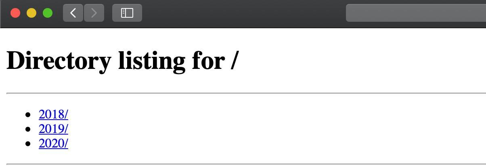
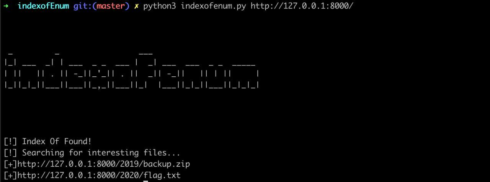

IndexOfEnum 
===


 
[](https://twitter.com/phor3nsic_br)

## Install and Usage

1. Install:
```
git clone https://github.com/phor3nsic/indexofEnum
cd indexofEnum
pip3 install -r requirements.txt

``` 
2. Usage:

```
python3 indexofenum.py -u http://taget.com/
```

## Example

```
usage: indexofenum.py [-h] [-u URL] [-l LIST] [-d DEBUG] [-o OUTPUT] [-w WORDLIST]

Enumerate files in index of

optional arguments:
  -h, --help            show this help message and exit
  -u URL, --url URL     Url for enum, -u http://target.com/
  -l LIST, --list LIST  List of targets for check, -l targets.txt
  -d DEBUG, --debug DEBUG
                        Active Debug mode, -d True or -d False, default:False
  -o OUTPUT, --output OUTPUT
                        Save output file, -o outfile.txt
  -w WORDLIST, --wordlist WORDLIST
                        Wordlist of extentions, -w wordlist.txt
```

1. Search target:



2. Run tool:

```
python3 indexofenum.py -u http://taget.com/ 

```



## Appendix and FAQ

:::info
**Find this document incomplete?** Leave a comment!
:::

